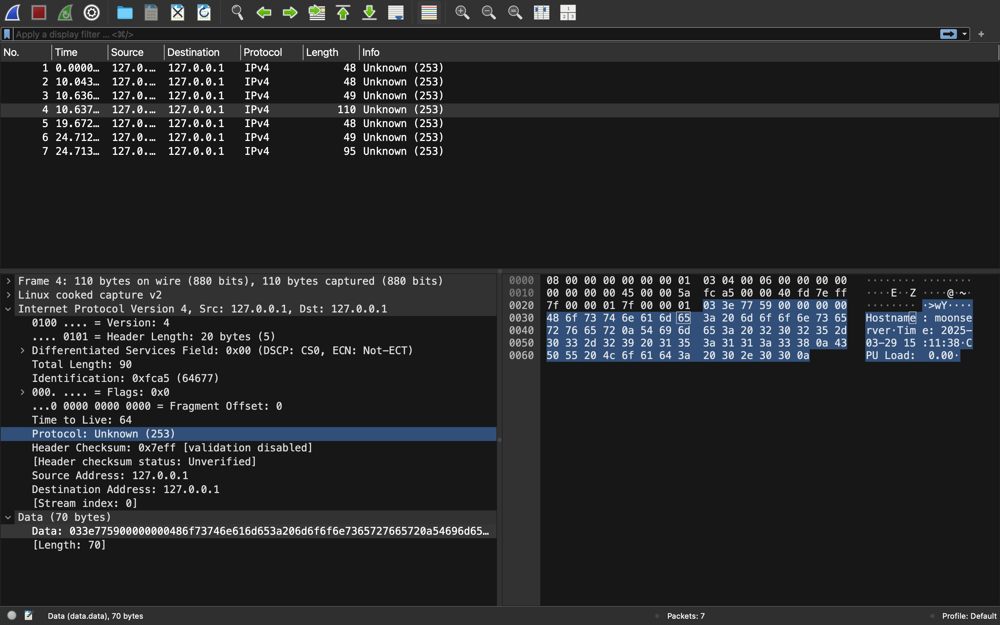

> ###### reference: [A Guide to Using Raw Sockets](https://www.opensourceforu.com/2015/03/a-guide-to-using-raw-sockets/)
---


# CLDP (Custom Lightweight Discovery Protocol)

## Specification

### 1. Introduction
The Custom Lightweight Discovery Protocol (CLDP) is a simple protocol designed for node discovery and metadata exchange in a network. It operates over raw sockets using a custom IP protocol number and provides lightweight discovery capabilities via HELLO announcements and QUERY/RESPONSE mechanisms.

### 2. Assumptions and Limitations
- The protocol operates on IPv4.
- It uses a custom IP protocol number (253) for communication.
- The protocol does not implement authentication or encryption.
- The system must allow the creation of raw sockets (requires root privileges in most systems).
- The server sends HELLO announcements every 10 seconds.
- The client listens for HELLO from server(s) for 10 seconds.
- Then the client sends custom query to the active servers.
- Query responses provide metadata such as hostname, system time, and CPU load.
- The maximum payload size is 1024 bytes.

### 3. Message Types
The CLDP protocol defines the following message types:

| Message Type | Code  | Description |
|-------------|------|-------------|
| HELLO       | 0x01 | Announced by servers periodically for discovery. |
| QUERY       | 0x02 | Sent by clients to request metadata. |
| RESPONSE    | 0x03 | Sent by the server in response to a QUERY message. |

### 4. Message Structure
Each CLDP packet consists of an IP header followed by a CLDP header and an optional payload.

#### 4.1 CLDP Header (8 bytes)
| Field        | Size (bytes) | Description |
|-------------|-------------|-------------|
| msg_type    | 1           | Type of message (HELLO, QUERY, RESPONSE) |
| payload_len | 1           | Length of payload in bytes |
| trans_id    | 2           | Unique transaction identifier |
| reserved    | 4           | Reserved for future use |

#### 4.2 Payload
- **HELLO:** No payload.
- **QUERY:** A 1-byte bitmask indicating requested metadata.
- **RESPONSE:** Variable-length text containing requested metadata.

### 5. Metadata Flags
| Flag Name  | Value  | Description |
|-----------|-------|-------------|
| META_HOSTNAME | 0x01 | Request hostname |
| META_TIME     | 0x02 | Request system time |
| META_CPULOAD  | 0x04 | Request CPU load |

### 6. Packet Exchange
#### 6.1 HELLO Announcement
The server broadcasts a HELLO message every 10 seconds to announce its presence.

#### 6.2 Query-Response Mechanism
1. **Client Sends Query:**
   - The client constructs a QUERY message, setting the `msg_type` field to `0x02`.
   - A unique `trans_id` is assigned to the request for tracking purposes.
   - The `payload_len` field is set to 1 byte, containing a bitmask representing the requested metadata (e.g., hostname, system time, CPU load).
   - The QUERY message is then sent to the CLDP server using raw sockets.

2. **Server Processes Query:**
   - The server receives the QUERY message and extracts the `trans_id` and metadata bitmask from the payload.
   - It checks the bitmask to determine which metadata fields are requested.
   - The server retrieves the requested metadata:
     - If the `META_HOSTNAME` flag is set, it retrieves the system hostname.
     - If the `META_TIME` flag is set, it fetches the current system time.
     - If the `META_CPULOAD` flag is set, it computes the CPU load.
   - The retrieved metadata is formatted into a response payload.

3. **Server Sends Response:**
   - The server constructs a RESPONSE message, setting `msg_type` to `0x03`.
   - The `trans_id` from the QUERY message is copied to the RESPONSE message for correlation.
   - The payload contains the formatted metadata values.
   - The RESPONSE message is sent back to the client using raw sockets.

4. **Client Receives Response:**
   - The client listens for a RESPONSE message from the server.
   - Upon receiving the RESPONSE, it extracts the `trans_id` to match it with the original QUERY request.
   - The client parses the metadata from the payload and processes it accordingly.

### 7. Error Handling
- If a received message has an invalid structure, it is ignored.
- If the requested metadata is unavailable, the server returns an empty RESPONSE.
- Packets from unknown protocols are ignored.

---

## Build and run instructions

1. to run cldp_server in a terminal
```bash
make rs
```
2. to run cldp_client in other terminal
```bash
make rc
```
> We are using raw sockets and need root(`sudo`) privileges
---
## CLDP Validation

## **1. Using `tcpdump`**
`tcpdump` is a command-line packet analyzer that can be used to capture raw socket traffic.

### **Start Capturing Traffic**
Run the following command **before** starting your CLDP server and client:
```sh
sudo tcpdump -i any proto 253 -vv
```
- `-i any` → Captures packets on all network interfaces.
- `proto 253` → Filters packets using your custom protocol number (253).
- `-vv` → Displays verbose output with packet details.

To save the captured packets for later analysis:
```sh
sudo tcpdump -i any proto 253 -w cldp_traffic.pcap
```
This saves the packets in a `.pcap` file, which can be analyzed later using Wireshark.

- To stop `tcpdump`, press **Ctrl+C**.

## **2. Using Wireshark**
Wireshark is a GUI-based packet analyzer that provides more detailed visualization.

### **Start Capturing**
1. Open Wireshark.
2. Select the appropriate network interface (e.g., `eth0`, `wlan0`, `lo0`).
3. Apply a capture filter for your custom protocol:
   ```
   ip proto 253
   ```
4. Click **Start** to begin capturing packets.

After testing, stop the capture and save the file:
- **File → Save As → cldp_traffic.pcapng**

### **Analyze the Packets**
- You should see raw packets under **Protocol: IPv4** (since your protocol is at the IP level).
- Expand the IP header section to verify:
  - **Protocol** → 253 (custom protocol)
  - **Source/Destination IPs**
  - **Total length**
  - **Checksum**

- Expand the packet payload section to check your **CLDP message types and payload**.



--- 

## **Understanding the Code**

### **1. Declaring and Casting the IP Header**
```c
struct iphdr *ip_hdr = (struct iphdr *)buffer;
```
- `buffer` is assumed to be a memory block where the IP header will be stored.
- The `struct iphdr` is a standard Linux structure representing an IPv4 header (found in `<linux/ip.h>` or `<netinet/ip.h>`).
- The `(struct iphdr *)buffer` casts the memory location to treat it as an `iphdr` structure.

---

### **2. Setting IP Header Fields**

#### **Internet Header Length (`ihl`)**
```c
ip_hdr->ihl = 5;
```
- `ihl` stands for **Internet Header Length**.
- The value `5` means **5 words of 4 bytes each**, totaling **20 bytes** (the standard IPv4 header size).
- `ihl` is measured in **32-bit words**, so `5 * 4 = 20` bytes.

#### **IP Version (`version`)**
```c
ip_hdr->version = 4;
```
- The IP version is **IPv4**.

#### **Type of Service (`tos`)**
```c
ip_hdr->tos = 0;
```
- `tos` (Type of Service) is used for Quality of Service (QoS).
- `0` means default service (no priority handling).

#### **Total Length (`tot_len`)**
```c
int total_len = sizeof(struct iphdr) + sizeof(cldp_header_t) + payload_len;
ip_hdr->tot_len = htons(total_len);
```
- The **total length** includes:
  - The IPv4 header (`sizeof(struct iphdr)`)
  - A **custom protocol header** (`sizeof(cldp_header_t)`, which is not defined here)
  - The **payload size** (`payload_len`).
- `htons()` ensures the value is converted to **network byte order** (big-endian).

#### **Identification (`id`)**
```c
ip_hdr->id = htons(rand() % 65535);
```
- `id` is used to identify fragmented packets.
- `rand() % 65535` assigns a random **packet identifier**.
- `htons()` converts it to **network byte order**.

#### **Fragmentation Offset (`frag_off`)**
```c
ip_hdr->frag_off = 0;
```
- This means **no fragmentation** (DF = 0, MF = 0).
- If fragmenting, this field would hold fragment offsets.

#### **Time to Live (`ttl`)**
```c
ip_hdr->ttl = 64;
```
- **TTL (Time to Live)** controls how many hops (routers) the packet can traverse before being discarded.
- `64` is a common default.

#### **Protocol (`protocol`)**
```c
ip_hdr->protocol = PROTOCOL_NUM;
```
- This specifies the **next protocol** (e.g., TCP, UDP, ICMP).
- `PROTOCOL_NUM` is a placeholder, which should be replaced by actual protocol values like:
  - `6` for TCP
  - `17` for UDP
  - `1` for ICMP

#### **Source Address (`saddr`)**
```c
ip_hdr->saddr = INADDR_ANY;
```
- The **source IP address** is set to `INADDR_ANY` (0.0.0.0).
- Normally, you would use a real source IP (`inet_addr("192.168.1.1")`).

#### **Destination Address (`daddr`)**
```c
ip_hdr->daddr = dest->sin_addr.s_addr;
```
- The destination IP (`daddr`) is copied from the `dest` struct (`struct sockaddr_in`).
- `dest->sin_addr.s_addr` holds the actual IP address.

---

### **3. Calculating the IP Header Checksum**
```c
ip_hdr->check = 0;
ip_hdr->check = checksum((unsigned short *)ip_hdr, ip_hdr->ihl * 2);
```
- The **checksum** is required for IPv4 headers.
- It first sets `check = 0` to clear any previous value.
- Then it calculates the checksum using the function `checksum()`.
- The checksum is computed over the **IP header only** (`ip_hdr->ihl * 2` because `ihl` is in 32-bit words).

---